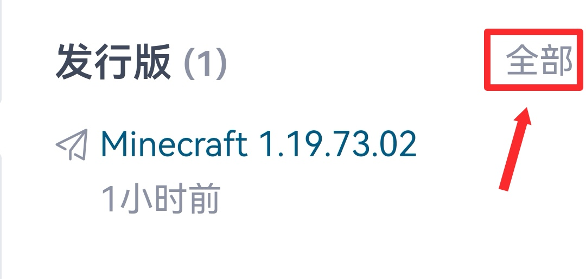

# Minecraft-in-China
## 导语
当你费尽千辛万苦在谷歌商店购买了 Minecraft PE 并安装到手机上准备游戏时，是否会遇见一个烦人的证书错误阻碍你的游戏。(T＿T)
  
幸运的是，这就是一个旨在解决这个问题的项目！
 
## 为什么会出现这个问题？
相信很多人都会有这个疑问，这里也就简单的解释一下。 
Minecraft PE是依靠 Google 账号进行正版验证的，但登陆账号却是微软Xbox账户，所以Google账号与用户的游戏内身份没有一点关系，仅仅只是被用来校验正版。正因为如此，每次打开游戏都必须保证自己能正常访问Google服务，让Google Play与服务器校验，验证成功之后才能启动。如果无法访问Google服务，否则Minecraft PE就会直接报错，不能进入游戏。因为国外能正常访问Google服务，所以基本不会出现这种情况。但是在国内，因为某些不可抗力的因素，用户并不能随时随地的访问Google服务，所以就会出现加载界面的错误信息。
 
## 如何使用
### 免责声明
禁止将本项目用于一切违法犯罪行为，一切不当使用本项目所造成的后果由使用人承担，所提供的安装包仅供拥有Minecraft PE正版账号的玩家或学习交流使用，若为学习交流使用，请在下载后24小时内删除。 
下载安装包即为同意此须知！ 
### 安装前准备
安卓手机一部，Minecraft PE正版账号，微软Xbox账户。
### 教程
点击项目右侧发行版，如图。

