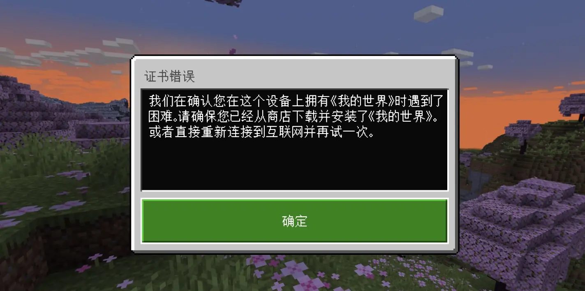
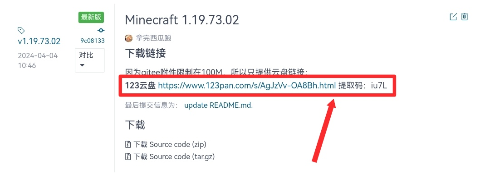

# Minecraft-in-China
## 导语
当你费尽千辛万苦在谷歌商店购买了 Minecraft PE 并安装到手机上准备游戏时，是否会遇见一个烦人的证书错误阻碍你的游戏。(T＿T)
 <br>
幸运的是，这就是一个旨在解决这个问题的项目！
<br>
## 为什么会出现这个问题？
相信很多人都会有这个疑问，这里也就简单的解释一下。<br>
Minecraft PE是依靠 Google 账号进行正版验证的，但登陆账号却是微软Xbox账户，所以Google账号与用户的游戏内身份没有一点关系，仅仅只是被用来校验正版。正因为如此，每次打开游戏都必须保证自己能正常访问Google服务，让Google Play与服务器校验，验证成功之后才能启动。如果无法访问Google服务，否则Minecraft PE就会直接报错，不能进入游戏。因为国外能正常访问Google服务，所以基本不会出现这种情况。但是在国内，因为某些不可抗力的因素，用户并不能随时随地的访问Google服务，所以就会出现加载界面的错误信息。
<br>
## 如何使用
### 免责声明
禁止将本项目用于一切违法犯罪行为，一切不当使用本项目所造成的后果由使用人承担，所提供的安装包仅供拥有Minecraft PE正版账号的玩家或学习交流使用，若为学习交流使用，请在下载后24小时内删除。<br>
下载安装包即为同意此须知！<br>
### 安装前准备
安卓手机一部，Minecraft PE正版账号，微软Xbox账户。
### 教程
先点击项目右侧发行版，如图。

然后选择一个你想要下载的版本，下载安装包。

最后安装应用程序，登录微软Xbox帐号，开始愉快的游戏！
<br>
## 关于安全
在整个项目中，我们仅对LicenseChecker.smali这一个文件进行了修改。如果您对安全方面有任何问题，可以查看下方的代码

```
.class public Lcom/googleplay/licensing/LicenseChecker;
.super Ljava/lang/Object;
.source "LicenseChecker.java"

# interfaces
.implements Landroid/content/ServiceConnection;


# annotations
.annotation system Ldalvik/annotation/MemberClasses;
    value = {
        Lcom/googleplay/licensing/LicenseChecker$ResultListener;
    }
.end annotation


# static fields
.field private static final DEBUG_LICENSE_ERROR:Z = false

.field private static final KEY_FACTORY_ALGORITHM:Ljava/lang/String; = "RSA"

.field private static final RANDOM:Ljava/security/SecureRandom;

.field private static final TAG:Ljava/lang/String; = "LicenseChecker"

.field private static final TIMEOUT_MS:I = 0x2710


# instance fields
.field private final mChecksInProgress:Ljava/util/Set;
    .annotation system Ldalvik/annotation/Signature;
        value = {
            "Ljava/util/Set<",
            "Lcom/googleplay/licensing/LicenseValidator;",
            ">;"
        }
    .end annotation
.end field

.field private final mContext:Landroid/content/Context;

.field private mHandler:Landroid/os/Handler;

.field private final mPackageName:Ljava/lang/String;

.field private final mPendingChecks:Ljava/util/Queue;
    .annotation system Ldalvik/annotation/Signature;
        value = {
            "Ljava/util/Queue<",
            "Lcom/googleplay/licensing/LicenseValidator;",
            ">;"
        }
    .end annotation
.end field

.field private final mPolicy:Lcom/googleplay/licensing/Policy;

.field private mPublicKey:Ljava/security/PublicKey;

.field private mService:Lcom/googleplay/licensing/ILicensingService;

.field private final mVersionCode:Ljava/lang/String;


# direct methods
.method static constructor <clinit>()V
    .registers 1

    .line 65
    new-instance v0, Ljava/security/SecureRandom;

    invoke-direct {v0}, Ljava/security/SecureRandom;-><init>()V

    sput-object v0, Lcom/googleplay/licensing/LicenseChecker;->RANDOM:Ljava/security/SecureRandom;

    return-void
.end method

.method public constructor <init>(Landroid/content/Context;Lcom/googleplay/licensing/Policy;Ljava/lang/String;)V
    .registers 5
    .annotation system Ldalvik/annotation/MethodParameters;
        accessFlags = {
            0x0,
            0x0,
            0x0
        }
        names = {
            "context",
            "policy",
            "encodedPublicKey"
        }
    .end annotation

    .line 89
    invoke-direct {p0}, Ljava/lang/Object;-><init>()V

    .line 80
    new-instance v0, Ljava/util/HashSet;

    invoke-direct {v0}, Ljava/util/HashSet;-><init>()V

    iput-object v0, p0, Lcom/googleplay/licensing/LicenseChecker;->mChecksInProgress:Ljava/util/Set;

    .line 81
    new-instance v0, Ljava/util/LinkedList;

    invoke-direct {v0}, Ljava/util/LinkedList;-><init>()V

    iput-object v0, p0, Lcom/googleplay/licensing/LicenseChecker;->mPendingChecks:Ljava/util/Queue;

    .line 90
    iput-object p1, p0, Lcom/googleplay/licensing/LicenseChecker;->mContext:Landroid/content/Context;

    .line 91
    iput-object p2, p0, Lcom/googleplay/licensing/LicenseChecker;->mPolicy:Lcom/googleplay/licensing/Policy;

    .line 92
    invoke-static {p3}, Lcom/googleplay/licensing/LicenseChecker;->generatePublicKey(Ljava/lang/String;)Ljava/security/PublicKey;

    move-result-object p2

    iput-object p2, p0, Lcom/googleplay/licensing/LicenseChecker;->mPublicKey:Ljava/security/PublicKey;

    .line 93
    invoke-virtual {p1}, Landroid/content/Context;->getPackageName()Ljava/lang/String;

    move-result-object p2

    iput-object p2, p0, Lcom/googleplay/licensing/LicenseChecker;->mPackageName:Ljava/lang/String;

    .line 94
    invoke-static {p1, p2}, Lcom/googleplay/licensing/LicenseChecker;->getVersionCode(Landroid/content/Context;Ljava/lang/String;)Ljava/lang/String;

    move-result-object p1

    iput-object p1, p0, Lcom/googleplay/licensing/LicenseChecker;->mVersionCode:Ljava/lang/String;

    .line 95
    new-instance p1, Landroid/os/HandlerThread;

    const-string p2, "background thread"

    invoke-direct {p1, p2}, Landroid/os/HandlerThread;-><init>(Ljava/lang/String;)V

    .line 96
    invoke-virtual {p1}, Landroid/os/HandlerThread;->start()V

    .line 97
    new-instance p2, Landroid/os/Handler;

    invoke-virtual {p1}, Landroid/os/HandlerThread;->getLooper()Landroid/os/Looper;

    move-result-object p1

    invoke-direct {p2, p1}, Landroid/os/Handler;-><init>(Landroid/os/Looper;)V

    iput-object p2, p0, Lcom/googleplay/licensing/LicenseChecker;->mHandler:Landroid/os/Handler;

    return-void
.end method

.method static synthetic access$100(Lcom/googleplay/licensing/LicenseChecker;Lcom/googleplay/licensing/LicenseValidator;)V
    .registers 2

    .line 57
    invoke-direct {p0, p1}, Lcom/googleplay/licensing/LicenseChecker;->handleServiceConnectionError(Lcom/googleplay/licensing/LicenseValidator;)V

    return-void
.end method

.method static synthetic access$200(Lcom/googleplay/licensing/LicenseChecker;Lcom/googleplay/licensing/LicenseValidator;)V
    .registers 2

    .line 57
    invoke-direct {p0, p1}, Lcom/googleplay/licensing/LicenseChecker;->finishCheck(Lcom/googleplay/licensing/LicenseValidator;)V

    return-void
.end method

.method static synthetic access$300(Lcom/googleplay/licensing/LicenseChecker;)Ljava/util/Set;
    .registers 1

    .line 57
    iget-object p0, p0, Lcom/googleplay/licensing/LicenseChecker;->mChecksInProgress:Ljava/util/Set;

    return-object p0
.end method

.method static synthetic access$500(Lcom/googleplay/licensing/LicenseChecker;)Ljava/security/PublicKey;
    .registers 1

    .line 57
    iget-object p0, p0, Lcom/googleplay/licensing/LicenseChecker;->mPublicKey:Ljava/security/PublicKey;

    return-object p0
.end method

.method static synthetic access$600(Lcom/googleplay/licensing/LicenseChecker;)Landroid/os/Handler;
    .registers 1

    .line 57
    iget-object p0, p0, Lcom/googleplay/licensing/LicenseChecker;->mHandler:Landroid/os/Handler;

    return-object p0
.end method

.method private cleanupService()V
    .registers 3

    .line 306
    iget-object v0, p0, Lcom/googleplay/licensing/LicenseChecker;->mService:Lcom/googleplay/licensing/ILicensingService;

    if-eqz v0, :cond_0

    .line 308
    :try_start_0
    iget-object v0, p0, Lcom/googleplay/licensing/LicenseChecker;->mContext:Landroid/content/Context;

    invoke-virtual {v0, p0}, Landroid/content/Context;->unbindService(Landroid/content/ServiceConnection;)V
    :try_end_0
    .catch Ljava/lang/IllegalArgumentException; {:try_start_0 .. :try_end_0} :catch_0

    goto :goto_0

    :catch_0
    const-string v0, "LicenseChecker"

    const-string v1, "Unable to unbind from licensing service (already unbound)"

    .line 312
    invoke-static {v0, v1}, Landroid/util/Log;->e(Ljava/lang/String;Ljava/lang/String;)I

    :goto_0
    const/4 v0, 0x0

    .line 314
    iput-object v0, p0, Lcom/googleplay/licensing/LicenseChecker;->mService:Lcom/googleplay/licensing/ILicensingService;

    :cond_0
    return-void
.end method

.method private declared-synchronized finishCheck(Lcom/googleplay/licensing/LicenseValidator;)V
    .registers 3
    .annotation system Ldalvik/annotation/MethodParameters;
        accessFlags = {
            0x0
        }
        names = {
            "validator"
        }
    .end annotation

    monitor-enter p0

    .line 193
    :try_start_0
    iget-object v0, p0, Lcom/googleplay/licensing/LicenseChecker;->mChecksInProgress:Ljava/util/Set;

    invoke-interface {v0, p1}, Ljava/util/Set;->remove(Ljava/lang/Object;)Z

    .line 194
    iget-object p1, p0, Lcom/googleplay/licensing/LicenseChecker;->mChecksInProgress:Ljava/util/Set;

    invoke-interface {p1}, Ljava/util/Set;->isEmpty()Z

    move-result p1

    if-eqz p1, :cond_0

    .line 195
    invoke-direct {p0}, Lcom/googleplay/licensing/LicenseChecker;->cleanupService()V
    :try_end_0
    .catchall {:try_start_0 .. :try_end_0} :catchall_0

    .line 197
    :cond_0
    monitor-exit p0

    return-void

    :catchall_0
    move-exception p1

    monitor-exit p0

    throw p1
.end method

.method private generateNonce()I
    .registers 2

    .line 333
    sget-object v0, Lcom/googleplay/licensing/LicenseChecker;->RANDOM:Ljava/security/SecureRandom;

    invoke-virtual {v0}, Ljava/security/SecureRandom;->nextInt()I

    move-result v0

    return v0
.end method

.method private static generatePublicKey(Ljava/lang/String;)Ljava/security/PublicKey;
    .registers 4
    .annotation system Ldalvik/annotation/MethodParameters;
        accessFlags = {
            0x0
        }
        names = {
            "encodedPublicKey"
        }
    .end annotation

    const-string v0, "LicenseChecker"

    .line 109
    :try_start_0
    invoke-static {p0}, Lcom/googleplay/util/Base64;->decode(Ljava/lang/String;)[B

    move-result-object p0

    const-string v1, "RSA"

    .line 110
    invoke-static {v1}, Ljava/security/KeyFactory;->getInstance(Ljava/lang/String;)Ljava/security/KeyFactory;

    move-result-object v1

    .line 112
    new-instance v2, Ljava/security/spec/X509EncodedKeySpec;

    invoke-direct {v2, p0}, Ljava/security/spec/X509EncodedKeySpec;-><init>([B)V

    invoke-virtual {v1, v2}, Ljava/security/KeyFactory;->generatePublic(Ljava/security/spec/KeySpec;)Ljava/security/PublicKey;

    move-result-object p0
    :try_end_0
    .catch Ljava/security/NoSuchAlgorithmException; {:try_start_0 .. :try_end_0} :catch_2
    .catch Lcom/googleplay/util/Base64DecoderException; {:try_start_0 .. :try_end_0} :catch_1
    .catch Ljava/security/spec/InvalidKeySpecException; {:try_start_0 .. :try_end_0} :catch_0

    return-object p0

    :catch_0
    move-exception p0

    const-string v1, "Invalid key specification."

    .line 120
    invoke-static {v0, v1}, Landroid/util/Log;->e(Ljava/lang/String;Ljava/lang/String;)I

    .line 121
    new-instance v0, Ljava/lang/IllegalArgumentException;

    invoke-direct {v0, p0}, Ljava/lang/IllegalArgumentException;-><init>(Ljava/lang/Throwab
```
